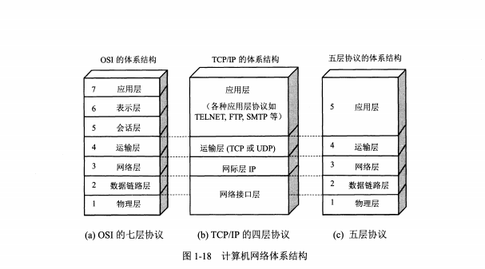

# 计算机网络体系结构

## 协议
  
<strong>协议</strong>由三部分组成：
* 语法：即数据与控制信息的结构或格式；
* 语义：即需要发出何种控制信息，完成何种动作和做出何种反应
* 同步：事件实现顺序的说明。

## 七层协议
* 物理层：底层数据传输，物理介质，网络设备终端之间的数据传输，<strong>单位是比特</strong>
  
* 数据链路层：定义数据的基本格式、如何传输、如何标识；将比特流组合成数据帧(帧首和帧尾)，对数据帧传递和错误检测(CRC循环校验，帧编号、确认和重传机制)；分情况进行：a.通信质量良好的链路，数据传输差错由传输层TCP协议来保证；b.通信质量差的链路，数据链路层使用确认和重传，保证向上提供可靠的传输服务。<strong>单位是数据帧</strong>，协议有：ARP、RARP。
  
* 网络层：定义IP地址，定义路由功能；网络层就是选择最佳路径传输，路由器的功能就是选择最佳路径，<strong>单位是分组</strong>；协议有IP，ICMP，IGMP。
  
* 传输层：端到端的数据传输的基本功能；负责数据进行可靠或不可靠传输。<strong>单位：TCP-报文段，UDP-用户数据报</strong>，协议有UDP、TCP。
  
* 会话层：控制应用程序间的会话能力，用来区分不同的进程。
* 表示层：数据格式标识，基本压缩加密功能。
* 应用层：各种应用软件，包括web应用。
  
## 四层协议

* TCP/IP 模型将 OSI 模型由七层简化为四层，传输层和网络层被完整保留，因此网络中最核心的技术就是传输层和网络层技术。

## 总结
网络七层模型是一个标准，而非实现。

网络四层模型是一个实现的应用模型。

网络四层模型由七层模型简化合并而来。